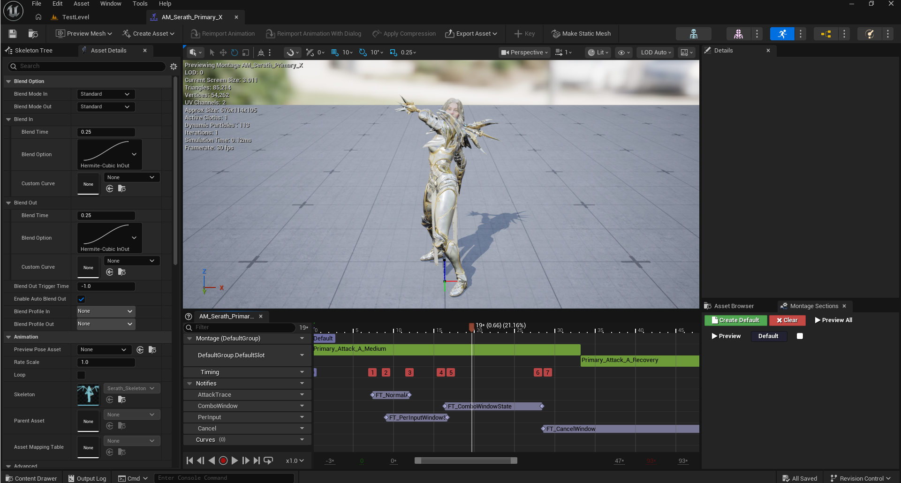
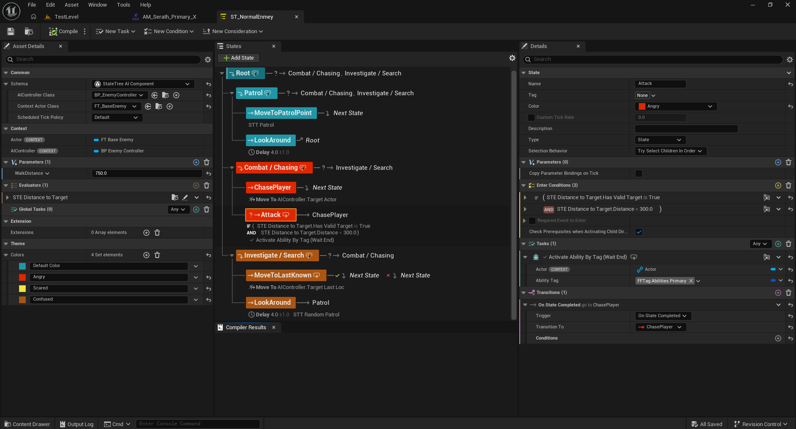
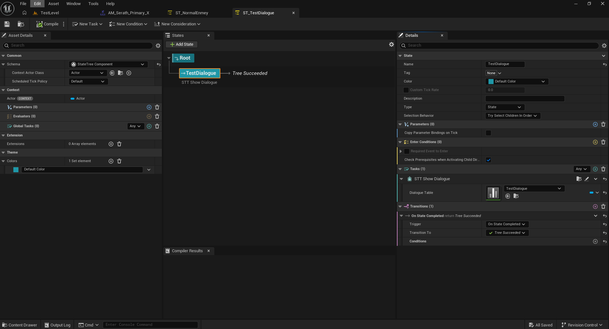
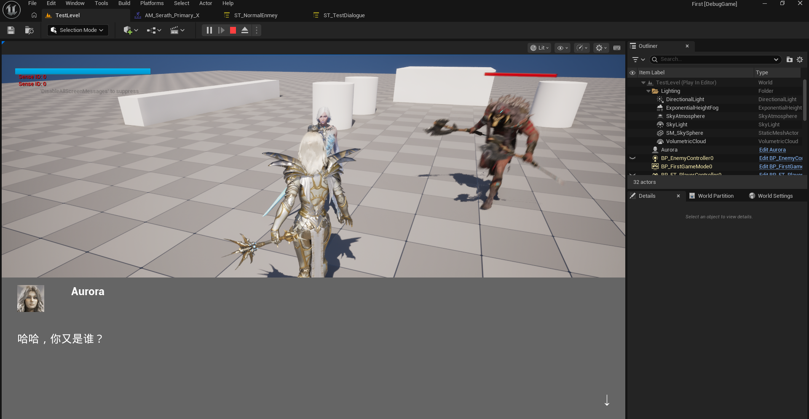

# UE-GAS-Combat-Demo

基于 **Unreal Engine 5.8** 的第三人称动作战斗原型，核心是一套构建在 **Gameplay Ability System (GAS)** 之上的自研**连段（Combo）系统**。

个人练习项目。

---

## 核心亮点

### 1. 连段树 —— 支持任意左/右键混合连段

连段不是硬编码的固定串，而是用一棵 `UFT_ComboDefinition`（DataAsset）描述：

```cpp
USTRUCT FFT_ComboNode
{
    FGameplayTag NodeTag;                          // 节点标识，如 FFTag.Combo.XY
    TSubclassOf<UFT_ComboGamePlayAbility> Ability; // 该节点对应的招式 GA
    TMap<FGameplayTag, FGameplayTag> NextByInput;  // 输入 tag → 下一节点 tag
};
```

- 每个「前缀路径」是一个节点，`NextByInput` 决定按左键 / 右键分别去往哪个节点。
- 因此 `xyyx`、`xxy` 这类任意左右混合路径都只是**数据配置**，不需要改代码。
- `StartNodesByInput` 支持多起手：左键起手走 X，右键起手走 Y。

### 2. 连段状态与招式解耦

连段进度（`CurrentNodeTag`）存在 `UFT_ComboComponent` 组件上，而不是招式 GA 里。

好处：翻滚取消、受击打断只会结束「当前这一招」，不会清掉连段整体进度。

### 3. 预输入缓冲（Input Buffering）

提前按下的攻击输入会被记在 `BufferedInputTag`（单槽，最新覆盖旧值），
等连段窗口打开或本招收招时自动触发，改善连续输入的跟手性。

### 4. 严格窗口 + 翻滚保留连段

- 接招必须处于窗口内——由动画 Notify `UFT_ComboWindowState` 驱动 `bComboWindowOpen`。
- 翻滚会取消当前招式，但保留连段进度（宽限 2s）；翻滚蒙太奇上同样挂了窗口与预输入 Notify，
  所以可以「翻滚 → 窗口内接下一招」。
- 翻滚结束仍未接招则丢弃残留缓冲，严格不接。

> 完整的架构说明、方法级调用链与状态位时序见 **[架构说明.md](架构说明.md)**。

---

## 目录结构

```
Source/First/
├── AbilitySystem/
│   ├── Abilities/        GA 基类（FT_GamePlayAbility / FT_ComboGamePlayAbility）与各招式
│   ├── Combat/           连段树 UFT_ComboDefinition、连段组件 UFT_ComboComponent、受击反应库
│   └── FT_AttributeSet   属性集（生命值等）
├── AI/                   StateTree 任务 / 条件 / 求值器，敌人 AIController
├── Characters/           玩家与敌人角色基类
├── Notifies/             动画 Notify：连段窗口 / 预输入窗口 / 取消窗口 / 命中检测
├── Player/               FT_PlayerController（Enhanced Input 入口）、FT_PlayerState
├── Widgets/              UMG 控件（C++ 基类）
├── Dialogue/             简易对话系统
└── GamePlayTags/         FTTag.h —— 全项目 GameplayTag 集中定义

Content/First/            自研蓝图资产
├── AbilitySystem/        GA / GE 蓝图
├── Characters/           角色蓝图、动画蓝图与动画蒙太奇
├── AI/                   StateTree / BehaviorTree / Blackboard
├── Input/                Enhanced Input Action 与 Mapping Context
├── Widgets/              UMG 控件蓝图
├── DataAsset/            连段树 DA_Serath_Combo 等
└── Level/                测试关卡

Docs/images/              README 演示截图
```

---

## 截图

### 动画蒙太奇上的窗口 / 预输入 / 命中 Notify



`AM_Serath_Primary_X` 的 Notify 轨道：`FT_NormalAttackState`（命中检测）、
`FT_ComboWindowState`（连段窗口）、`FT_PerInputWindowState`（预输入窗口）、`FT_CancelWindow`（取消窗口）。

### StateTree 实现敌人 AI



`ST_NormalEnmey`：Patrol / Combat_Chasing / Investigate_Search 三个状态，
由 `STC_DistanceToTarget` 条件与自定义 Task（`STT_MoveToNonAI`、`STT_SetCoolDown` 等）驱动，
脱战状态的 `Activate Ability By Tag` 任务按 `FFTag.Abilities.Primary` 激活攻击能力。

### StateTree 实现对话



`ST_TestDialogue`：单个 `STT_ShowDialogue` 任务读取 DataTable 播放对话。



运行效果：与 NPC 对话，底部对话框显示说话人与对话内容。

---

## 构建

需要 **Unreal Engine 5.8**。

1. 克隆仓库
2. 右键 `First.uproject` → Generate Visual Studio project files
3. 编译 `FirstEditor`（DebugGame，与编辑器加载的 DLL 保持一致）

   ```
   "<UE_ROOT>\Engine\Build\BatchFiles\Build.bat" FirstEditor Win64 DebugGame -Project="<REPO>\First.uproject" -WaitMutex
   ```

`First.Build.cs` 依赖模块：`EnhancedInput`、`GameplayAbilities`、`GameplayTags`、`GameplayTasks`、
`AIModule`、`UMG`、`StateTreeModule`、`GameplayStateTreeModule`。

---

## 关于素材（重要）

本仓库**只包含自研代码与蓝图**。以下第三方素材包因体积与版权原因未纳入版本控制：

| 目录 | 来源 |
|---|---|
| `Content/ParagonSerath` / `Content/ParagonAurora` / `Content/ParagonKhaimera` | Epic Games《Paragon》免费素材 |
| `Content/Fab` | Fab 商城素材 |
| `Content/AdvancedPortalsSystemVFX` | Fab 商城素材 |
| `Content/DynamicFalling` | Fab 商城素材 |
| `Content/RamsterZ_FreeAnims_Volume1` | Fab 商城素材 |

这些素材的授权允许在 Unreal 项目中使用，但**不允许再分发原始资源文件**，因此不包含在本仓库中。
把它们放回 `Content/` 下的对应路径后，工程即可正常打开并运行。

在缺少这些素材的情况下，**C++ 代码仍可正常编译**，但角色模型 / 动画 / 材质会显示为缺失引用。

---

## 说明

- 本项目为个人学习 Unreal Engine 与 GAS 的练习作品，不用于任何商业用途。
- 项目内引用的 Epic / Fab 素材，版权归各自所有者所有。
